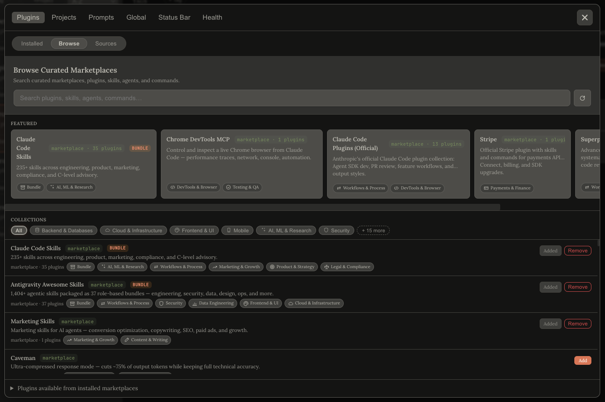
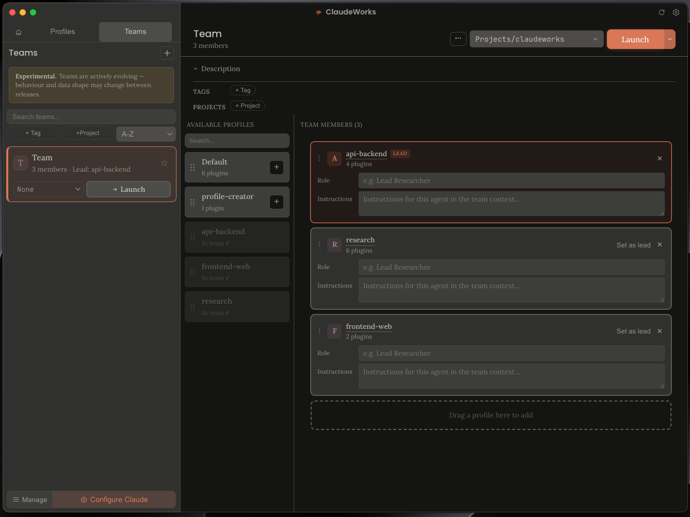
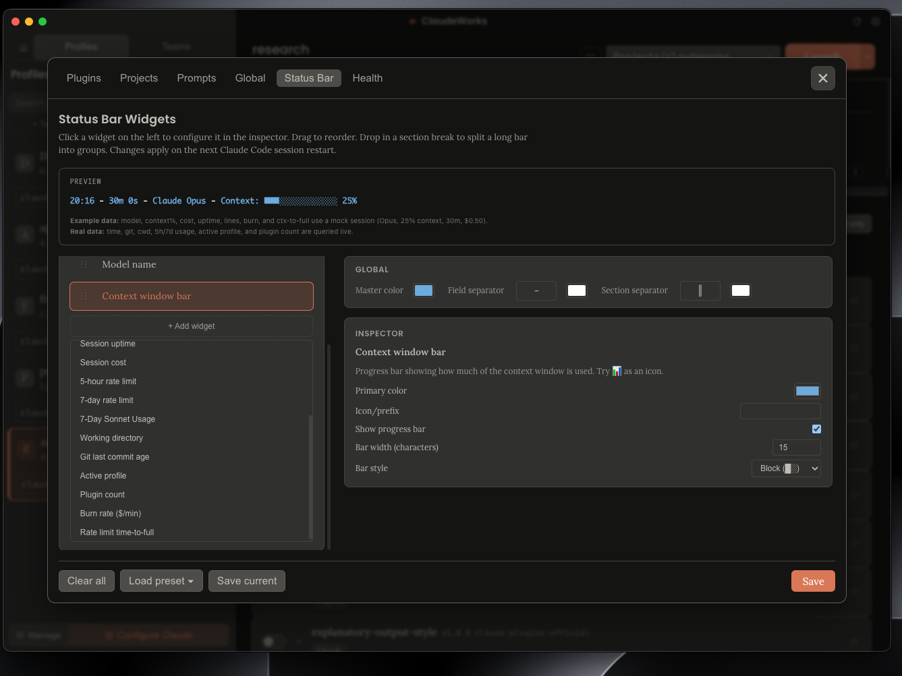

<p align="center">
  
</p>
<h1 align="center">ClaudeWorks</h1>
<p align="center"><strong>Named profiles for Claude Code.</strong></p>
<p align="center">
  <em>A macOS desktop app that manages Claude Code configurations as named, isolated profiles: plugins, MCP servers, skills, slash commands, and settings per session.</em>
</p>

<p align="center">
  
  
  
</p>

<p align="center">
  <a href="https://mduffy37.github.io/claudeworks/">Home</a>
  &nbsp;·&nbsp;
  <a href="https://mduffy37.github.io/claudeworks/docs/">Docs</a>
  &nbsp;·&nbsp;
  <a href="https://github.com/Mduffy37/claudeworks/releases">Releases</a>
  &nbsp;·&nbsp;
  <a href="https://github.com/Mduffy37/claudeworks/issues">Issues</a>
</p>

<p align="center">
  
</p>

---

## Why this exists

I kept managing two Claude Code setups by hand, the work one with its MCP servers and skill set, the personal one with a different CLAUDE.md and different tools. Swapping meant editing `~/.claude.json` and `mcp.json` by hand, then undoing it next session. Claude Code has no native multi-profile support, so I built this instead.

ClaudeWorks gives each configuration a real isolated environment: its own `CLAUDE_CONFIG_DIR`, its own MCP servers, its own skills. Plugin caches are shared via symlinks so you install once and updates propagate automatically. A curated marketplace with 647 featured plugins and 4,795 skills ships inside the app.

## What it does

- **Named profiles with real isolation.** Each profile runs in its own `CLAUDE_CONFIG_DIR`. MCP servers, skills, agents, and slash commands from profile A physically cannot appear in profile B's session (per-process isolation, not config swapping).

- **Curated plugin marketplace + global search.** Browse 114 curated marketplaces and 647 featured plugins without leaving the app. A single search bar queries **7,009 flat entries** (every marketplace, plugin, skill, command, agent, and MCP server) at once.

  

- **Multi-alias launch with per-alias directory and action.** One profile ships arbitrary shell aliases, each one cd's to a directory and optionally auto-runs `/workflow` or a saved prompt. One profile can intercept the bare `claude` command so plain `claude` in any terminal lands in your default profile, without the bloat of the other profiles.

  ```
  ship-api     → cd ~/code/api,    then /workflow
  debug-mobile → cd ~/code/mobile, then runs a prefilled prompt
  claude        → opens Default profile (bare-claude interception)
  ```

- **Per-profile `/workflow` (and named variants).** Write a `/workflow` body once per profile and it becomes a real Claude Code command in that profile's session. Named variants (`/workflow-debug`, `/workflow-deploy`) can be scoped to specific launch directories.

- **Multi-agent Teams _(experimental)_.** Compose a team from existing profiles with drag-and-drop, assign roles, pick a lead, and launch. The lead runs a generated `/start-team` that spawns each teammate via Claude Code's native agent-teams feature.

  

- **Per-profile MCP management, down to the directory.** Global MCP servers (`~/.claude.json`) and project-scoped ones (`~/.mcp.json`) both surface in every profile. Each profile can disable individual servers per-directory: load `context7` at home, skip it inside a sensitive repo.

- **Status bar builder with 17 widgets, saveable.** Drag-to-reorder custom status bar (model, branch, context, usage, cost, rate limits, section breaks, per-widget options), named save/load, and per-profile override.

  

- Export a profile as a self-contained JSON (`exportProfile`) and import it on another machine. `importProfile` shows you exactly which plugins are missing before you try to run it.

- **Profiles Doctor** runs a health check across your profiles, plugins, and alias scripts, flagging orphaned config, broken plugin refs, and alias collisions. Detect mode is read-only. Repair mode prompts before touching anything and writes a `.bak-<ts>` first.

- Local skills in `~/.claude/skills/` show where they came from: a `.skillfish.json` marker gets a cyan `skillfish` tag; a `.git/` directory with a resolvable remote gets a violet `git` tag.

## What it doesn't do

macOS only at launch. Windows is planned and Linux likely follows. The Electron shell is already cross-platform, but the terminal launch and Keychain sync need ports.

Profiles live on your machine, no cloud sync. Use `exportProfile` / `importProfile` to move them.

No GitHub token required. ClaudeWorks tries the `gh` CLI first, then `GITHUB_TOKEN`, then falls back to anonymous fetches (60 req/h). See [Architecture](#architecture) for the fallback chain.

Teams need Anthropic's experimental flag (`CLAUDE_CODE_EXPERIMENTAL_AGENT_TEAMS=1`). The feature works today but expect behaviour to shift as the upstream matures.

We don't generate or manage Claude API keys. Run `claude login` first. The app copies credentials from your existing login.

## Install

### From a release

1. Download the latest `.dmg` from the [Releases](https://github.com/Mduffy37/claudeworks/releases) page.
2. Open the DMG and drag ClaudeWorks to Applications.
3. First launch, macOS will flag the app as unsigned; right-click, Open, confirm.
4. Run `gh auth login` if you haven't. ClaudeWorks uses the `gh` CLI for GitHub API calls, which gives you 5,000 req/h instead of 60.

### From source

```bash
git clone https://github.com/Mduffy37/claudeworks.git
cd claudeworks
npm install
npm run build
npm start
```

Requires Node 20+, Electron 33, and the `gh` CLI on your `PATH` for marketplace features. Run `npm run dev` for the Vite dev server + Electron watch loop.

## Quickstart

### Create your first profile

1. Launch ClaudeWorks. The sidebar shows your profiles (the app seeds a `profile-creator` workspace to help you author one).
2. Click **New profile** in the sidebar dock.
3. Pick which plugins, skills, agents, and MCP servers load in this profile. Everything defaults to off. Opt in to what you want.
4. Click **Save**.

### Launch a profile

Click the **Launch** button on the profile card. A terminal opens with `CLAUDE_CONFIG_DIR` already set. Terminal.app is the default; iTerm2 can be selected in Settings, with more terminal options on the way.

Or type your shell alias. If you added `aliases: [{ name: "ship-api", directory: "~/code/api" }]` to the profile, `ship-api` from any terminal cd's to that directory and starts a Claude Code session in that profile.

### Discover plugins

Open **Configure Claude → Plugins → Browse**. The global search bar queries every marketplace, plugin, skill, command, agent, and MCP server at once (7,009 entries across 114 marketplaces). Click any plugin card for the detail pane: upstream README rendered inline, with a peer-plugin list beside it.

## Architecture

### Profiles as config directories

Each profile lives at `~/.claudeworks/profiles/<name>/config/` and launches with `CLAUDE_CONFIG_DIR` pointing at it. This is Claude Code's built-in way to redirect its config root per session, so each profile's MCP servers and skills live in their own namespace.

Plugin caches under `~/.claude/plugins/cache/` are shared across profiles via symlinks. Installing a plugin once makes it available everywhere, and upstream updates propagate automatically. When a profile excludes a specific plugin item, ClaudeWorks materialises a small overlay for just the affected directory; everything else stays symlinked.

### Curated marketplace

The sibling repo [`claudeworks-marketplace`](https://github.com/Mduffy37/claudeworks-marketplace) publishes a v2 schema:

- `marketplaces[]`: whole upstream marketplaces to surface as drillable cards in the Browse tab.
- `plugins[]`: individually featured plugins.
- `collections[]`: shared taxonomy (e.g. "Testing", "Observability").
- `index.json`: a generated flat snapshot of every item across every marketplace. This backs the global search bar.

Current snapshot (2026-04-17):

| Item | Count |
|---|---|
| Marketplaces | 114 |
| Plugins | 647 |
| Skills | 4,795 |
| Agents | 802 |
| Commands | 628 |
| MCP servers | 23 |
| **Total entries** | **7,009** |

### GitHub backend with graceful fallback

Every GitHub fetch goes through a 3-level backend:

1. **`gh` CLI**: if you've run `gh auth login`, we use `execFileAsync("gh", ["api", ...])` for 5,000 req/h and private-repo access.
2. **`GITHUB_TOKEN` fetch**: if `$GITHUB_TOKEN` is set, we use it against `api.github.com` for 5,000 req/h.
3. **Anonymous fetch**: 60 req/h fallback. Works for browsing; just slower.

All fetches are LRU-cached (size 50) so revisiting a plugin detail pane is instant.

## Features in depth

### Multi-agent Teams _(experimental)_

ClaudeWorks can compose a team from your existing profiles and launch them together:

1. Create a team from the sidebar. Drag profiles in; assign roles; designate a lead.
2. Set per-member instructions. Each teammate gets its own `CLAUDE.md` plus ownership tags so delegations from the lead route to whichever member owns the named capability.
3. Launch. The lead opens in a new terminal with a generated `/start-team` command that spawns the rest via Claude Code's native agent-teams support.

Teams are flagged **experimental** because the underlying Anthropic feature is still behind `CLAUDE_CODE_EXPERIMENTAL_AGENT_TEAMS=1`. Expect behaviour to change as the upstream feature matures.

### Per-profile `/workflow` commands

Each profile carries an optional `/workflow` command body. On profile assembly, ClaudeWorks writes it to `<config-dir>/commands/workflow.md`. Any session launched from that profile can type `/workflow` and get the profile's tailored runbook.

Named variants let one profile ship multiple workflow commands (`/workflow-debug`, `/workflow-deploy`, `/workflow-lint`), each scoped to a launch directory. If you maintain three repos with different runbooks from one profile, each `cd` can land in the right workflow.

### Multi-alias launch

Every profile can ship arbitrary shell aliases. Each alias has its own optional `directory` (the terminal cd's there before launching) and its own `launchAction`:

- `workflow`: auto-runs `/workflow` once the session starts.
- `prompt`: passes a prefilled prompt to `claude -p "<text>"` so the session opens already working.

Conflict detection catches alias collisions across profiles at save time. One profile can flag itself `isDefault: true`, which installs a bare-`claude` alias so plain `claude` in any shell runs inside that profile's config dir.

### Status bar builder

Drag-to-reorder builder for the Claude Code status bar. 17 widgets (model, branch, context window, usage, cost, rate limits, 7-day Sonnet usage, and more), section-break sentinels, per-widget options, live preview. Save configs by name, load them later, and override per-profile.

### Profile export / import

`exportProfile` writes a self-contained JSON including the plugin list, exclusions, aliases, workflows, MCP overrides, env vars, and settings. On the other machine, `importProfile` reads the file and surfaces a `missingPlugins[]` list (exactly which plugins the new machine needs before the profile will fully load).

### Profiles Doctor

A diagnostic pass across `profiles.json`, `teams.json`, `installed_plugins.json`, the aliases under `~/.claudeworks/bin/`, and plugin reference integrity. Detect mode is read-only. Repair mode is explicit-opt-in and always writes a `.bak-<timestamp>` before touching anything. `exportDiagnostics` bundles a sanitised snapshot for bug reports.

## FAQ

**"How does `CLAUDE_CONFIG_DIR` work?"**

`CLAUDE_CONFIG_DIR` is an environment variable Claude Code reads at startup to redirect its config root. Set it to `~/.claudeworks/profiles/work/config/` and Claude Code reads `profiles.json`, `mcp.json`, `commands/`, `agents/`, `skills/`, and `plugins/` from there instead of `~/.claude/`. ClaudeWorks sets this on launch. It's a first-class Claude Code feature, not a ClaudeWorks invention.

**"Do I need a GitHub token?"**

No. The app uses the `gh` CLI if authenticated, a `GITHUB_TOKEN` if one's in your env, and anonymous HTTP otherwise. Anonymous is rate-limited to 60 req/h by GitHub, so the first Browse-tab session runs out quickly. Run `gh auth login` once.

**"Is there telemetry?"**

No. The only network calls are the GitHub fetches for marketplace content and a release-version check when you ask for one. Both are readable in `src/electron/marketplace.ts` and `src/electron/diagnostics.ts`.

**"What about Windows / Linux?"**

Planned. The Electron shell is already cross-platform; the terminal launch and macOS Keychain sync need ports. Open an issue if you want to work on either. Happy to share the architecture notes.

**"Can I use this without the marketplace?"**

Yes. Every profile feature works standalone. The marketplace is one tab inside one modal. Ignore it and the rest of the app is an offline profile manager.

## Documentation

Full docs at [mduffy37.github.io/claudeworks/docs](https://mduffy37.github.io/claudeworks/docs/).

- [Installation](https://mduffy37.github.io/claudeworks/docs/getting-started.html)
- [Quick Start](https://mduffy37.github.io/claudeworks/docs/quick-start.html)
- [Profile Editor](https://mduffy37.github.io/claudeworks/docs/profile-editor.html) (every tab)
- [Configure Claude](https://mduffy37.github.io/claudeworks/docs/configure-claude.html)
- [Aliases & Launch](https://mduffy37.github.io/claudeworks/docs/aliases.html)
- [Teams](https://mduffy37.github.io/claudeworks/docs/team-editor.html)
- [Profiles Doctor](https://mduffy37.github.io/claudeworks/docs/doctor.html)

## Contributing

Issues and feature requests are the best way to get involved. I read everything that comes in and they shape what I work on next. If something's broken or you have an idea, open an issue.

To add a plugin to the curated marketplace, open a PR against [`claudeworks-marketplace`](https://github.com/Mduffy37/claudeworks-marketplace) (not this repo). The `README.md` there documents the v2 schema.

## License

MIT. See [LICENSE](LICENSE).

## Acknowledgements

- Anthropic, for shipping Claude Code and for making `CLAUDE_CONFIG_DIR` a first-class feature.
- Every upstream plugin / skill / agent author whose work the curated marketplace surfaces. The marketplace is only useful because you shipped.
- The OSS tools that paved the road: cctm, claudectx, ccp, CCO.
