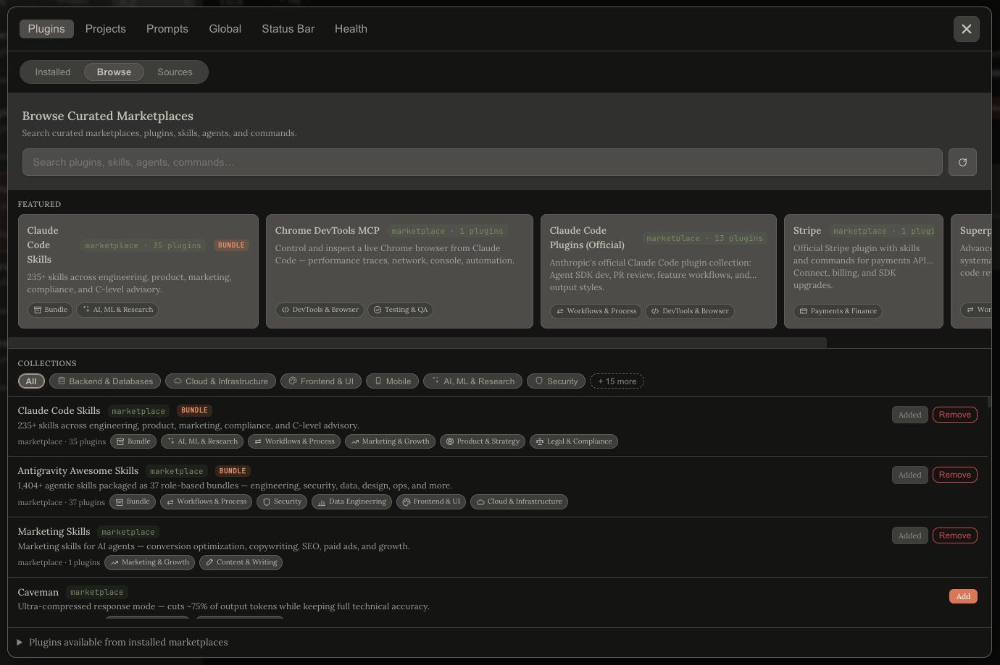

<p align="center">
  
</p>
<h1 align="center">ClaudeWorks</h1>
<p align="center">无需手动编辑配置，运行独立的 Claude Code 环境。</p>

<p align="center">
  
  
  
</p>

<p align="center">
  <a href="https://mduffy37.github.io/claudeworks/">主页</a>
  &nbsp;·&nbsp;
  <a href="https://mduffy37.github.io/claudeworks/docs/">文档</a>
  &nbsp;·&nbsp;
  <a href="https://github.com/Mduffy37/claudeworks/releases">发布</a>
  &nbsp;·&nbsp;
  <a href="https://github.com/Mduffy37/claudeworks/issues">问题</a>
</p>

> **[English](./README.md)** · 中文

每个 Profile 是一个独立的 Claude Code 配置目录：拥有自己的 MCP servers、Skills、Agents、斜杠命令和设置。一个终端用于工作，另一个用于个人用途，两者都运行 Claude Code 但加载不同的工具。内置 647 个精选 Plugin 和 4,795 个 Skills。

<p align="center">
  
</p>

---

## 为什么做这个

我一直在手动管理两套 Claude Code 环境：工作用的那套有自己的 MCP servers 和 Skills，个人用的那套有不同的 CLAUDE.md 和工具。切换意味着手动编辑 `~/.claude.json` 和 `mcp.json`，下一次会话再改回来。Claude Code 没有原生的多 Profile 支持，所以我做了这个。

Plugin 缓存通过符号链接在各 Profile 间共享，安装一次 Plugin，更新自动同步到所有地方。

## 它做什么

每个 Profile 运行在自己的 `CLAUDE_CONFIG_DIR` 下，这是 Claude Code 内置的配置根目录重定向方式。Profile A 的 MCP servers、Skills、Agents 和斜杠命令不会出现在 Profile B 的会话中。真正的进程级隔离，不是配置切换。

内置精选 Plugin Marketplace。浏览 114 个上游 Marketplace 和 647 个精选 Plugin，无需离开 ClaudeWorks。一个搜索栏同时查询 7,009 个条目（每个 Marketplace、Plugin、Skill、Command、Agent 和 MCP server）。

<p align="center">
  
</p>

每个 Profile 可以配置任意 Shell 别名。每个别名会 cd 到指定目录，并可选地自动运行 `/workflow` 或已保存的提示词。一个 Profile 可以声明 `claude` 命令，这样在任何终端输入 `claude` 都会进入你的默认 Profile，而不会加载其他 Profile 的内容。

```
ship-api     → cd ~/code/api,    然后 /workflow
debug-mobile → cd ~/code/mobile, 然后运行预填提示词
claude       → 打开默认 Profile（bare-claude 拦截）
```

<details>
<summary>更多功能</summary>

每个 Profile 的 `/workflow` 命令（以及命名变体如 `/workflow-debug`、`/workflow-deploy`）会成为该 Profile 会话中的真实 Claude Code 命令。变体可以限定到特定的启动目录。

多 Agent Teams _（实验性，需设置 `CLAUDE_CODE_EXPERIMENTAL_AGENT_TEAMS=1`）_：从现有 Profile 拖拽组建团队，分配角色，指定负责人，然后启动。负责人启动时会生成一个 `/start-team` 命令来创建每个队友。

按目录管理 MCP：在敏感仓库中禁用特定服务器，同时在其他地方保持可用。

状态栏构建器：17 个组件，拖拽重排，命名保存/加载，按 Profile 覆盖。

Profile 导出/导入：自包含 JSON 文件，精确列出目标机器缺少哪些 Plugin。

Profile Doctor：跨 Profile、Plugin 和别名脚本的只读健康检查。修复模式需要明确确认，且每次修改前都会创建 `.bak-<时间戳>` 备份。

本地 Skill 来源：`~/.claude/skills/` 中的 Skills 在来源可检测时会显示 `skillfish` 或 `git` 来源标签。

</details>

## 它不做什么

目前仅支持 macOS。Windows 计划中，Linux 可能随后支持。Electron 壳已经是跨平台的，但终端启动和 Keychain 同步需要移植。

Profile 存储在本地，没有云同步。使用 `exportProfile` / `importProfile` 来迁移。

不需要 GitHub token。ClaudeWorks 优先尝试 `gh` CLI，然后 `GITHUB_TOKEN`，最后回退到匿名请求（60 次/小时）。参见[架构](#架构)了解回退链。

Teams 需要 Anthropic 的实验性标志（`CLAUDE_CODE_EXPERIMENTAL_AGENT_TEAMS=1`）。该功能今天可用，但随着上游成熟，行为可能会变化。

我们不生成或管理 Claude API 密钥。请先运行 `claude login`。应用会从你现有的登录中复制凭据。

## 安装

### 从发布版本

1. 从 [Releases](https://github.com/Mduffy37/claudeworks/releases) 页面下载最新的 `.dmg`。
2. 打开 DMG，将 ClaudeWorks 拖到 Applications。
3. 首次启动时，macOS 会标记应用未签名；右键点击，打开，确认。
4. 如果还没登录，运行 `gh auth login`。ClaudeWorks 使用 `gh` CLI 进行 GitHub API 调用，可以获得 5,000 次/小时的配额而不是 60 次。

### 从源码

```bash
git clone https://github.com/Mduffy37/claudeworks.git
cd claudeworks
npm install
npm run build
npm start
```

需要 Node 20+、Electron 33，以及 `PATH` 中的 `gh` CLI（Marketplace 功能需要）。运行 `npm run dev` 启动 Vite 开发服务器 + Electron 监听循环。

## 快速开始

### 创建你的第一个 Profile

1. 启动 ClaudeWorks。侧边栏显示你的 Profile（应用会预置一个 `profile-creator` 工作区来帮助你创建）。
2. 点击侧边栏中的 **新建 Profile**。
3. 选择此 Profile 要加载的 Plugin、Skills、Agents 和 MCP servers。默认全部关闭，按需启用。
4. 点击 **保存**。

### 启动 Profile

点击 Profile 卡片上的 **启动** 按钮。一个终端会打开，`CLAUDE_CONFIG_DIR` 已自动设置。默认使用 Terminal.app；可以在设置中选择 iTerm2，更多终端选项即将推出。

或者输入你的 Shell 别名。如果你在 Profile 中添加了 `aliases: [{ name: "ship-api", directory: "~/code/api" }]`，在任何终端输入 `ship-api` 就会 cd 到该目录并以该 Profile 启动 Claude Code 会话。

### 发现 Plugin

打开 **配置 Claude → Plugin → 浏览**。全局搜索栏同时查询每个 Marketplace、Plugin、Skill、Command、Agent 和 MCP server（114 个 Marketplace 中的 7,009 个条目）。点击任何 Plugin 卡片查看详情：上游 README 内联渲染，旁边是相关 Plugin 列表。

## 架构

### Profile 作为配置目录

每个 Profile 存储在 `~/.claudeworks/profiles/<name>/config/`，启动时设置 `CLAUDE_CONFIG_DIR` 指向它。这是 Claude Code 内置的按会话重定向配置根目录的方式，因此每个 Profile 的 MCP servers 和 Skills 都在自己的命名空间中。

`~/.claude/plugins/cache/` 下的 Plugin 缓存通过符号链接在各 Profile 间共享。安装一次 Plugin 即可在所有地方使用，上游更新自动同步。当 Profile 排除特定 Plugin 项目时，ClaudeWorks 只为受影响的目录创建一个小的覆盖层；其他内容保持符号链接。

### 精选 Marketplace

配套仓库 [`claudeworks-marketplace`](https://github.com/Mduffy37/claudeworks-marketplace) 发布 v2 schema：

- `marketplaces[]`：要在浏览标签页中展示为可点击卡片的完整上游 Marketplace。
- `plugins[]`：单独精选的 Plugin。
- `collections[]`：共享分类（如"测试"、"可观测性"）。
- `index.json`：所有 Marketplace 中每个项目的扁平化快照。支持全局搜索栏。

当前快照（2026-04-17）：

| 项目 | 数量 |
|---|---|
| Marketplace | 114 |
| Plugin | 647 |
| Skills | 4,795 |
| Agents | 802 |
| Command | 628 |
| MCP servers | 23 |
| **总条目** | **7,009** |

### GitHub 后端与优雅回退

每个 GitHub 请求都经过 3 级后端：

1. **`gh` CLI**：如果你运行过 `gh auth login`，使用 `execFileAsync("gh", ["api", ...])` 获得 5,000 次/小时配额和私有仓库访问。
2. **`GITHUB_TOKEN` 请求**：如果设置了 `$GITHUB_TOKEN`，使用它访问 `api.github.com`，5,000 次/小时。
3. **匿名请求**：60 次/小时回退。可以浏览，只是较慢。

所有请求都有 LRU 缓存（大小 50），重新访问 Plugin 详情面板是即时的。

## 功能详情

### 多 Agent Teams _（实验性）_

ClaudeWorks 可以从现有 Profile 组建团队并一起启动：

1. 从侧边栏创建团队。拖入 Profile，分配角色，指定负责人。
2. 设置每个成员的指令。每个队友获得自己的 CLAUDE.md 和所有权标签，负责人的委派会路由到拥有该能力的成员。
3. 启动。负责人在新终端中打开，带有一个生成的 `/start-team` 命令，通过 Claude Code 原生的 Agent Teams 支持创建其他队友。

Teams 标记为 **实验性**，因为底层 Anthropic 功能仍在 `CLAUDE_CODE_EXPERIMENTAL_AGENT_TEAMS=1` 之后。随着上游功能成熟，行为可能会变化。

### 每个 Profile 的 `/workflow` 命令

每个 Profile 可以携带一个可选的 `/workflow` 命令内容。Profile 组装时，ClaudeWorks 将其写入 `<config-dir>/commands/workflow.md`。从该 Profile 启动的任何会话都可以输入 `/workflow` 获得该 Profile 的定制运行手册。

命名变体让一个 Profile 可以拥有多个 Workflow 命令（`/workflow-debug`、`/workflow-deploy`、`/workflow-lint`），每个限定到特定启动目录。如果你用一个 Profile 维护三个有不同运行手册的仓库，每次 `cd` 都能进入正确的 Workflow。

### 多别名启动

每个 Profile 可以配置任意 Shell 别名。每个别名有自己的可选 `directory`（终端在启动前 cd 到那里）和自己的 `launchAction`：

- `workflow`：会话启动后自动运行 `/workflow`。
- `prompt`：向 `claude -p "<text>"` 传递预填提示词，会话打开时已在工作中。

冲突检测在保存时捕获跨 Profile 的别名冲突。一个 Profile 可以标记 `isDefault: true`，这会安装一个 bare-`claude` 别名，让任何 Shell 中的 `claude` 都在该 Profile 的配置目录中运行。

### 状态栏构建器

拖拽重排的 Claude Code 状态栏构建器。17 个组件（模型、分支、上下文窗口、用量、成本、速率限制、7 天 Sonnet 用量等），分隔符，组件选项，实时预览。按名称保存配置，稍后加载，并可按 Profile 覆盖。

### Profile 导出/导入

`exportProfile` 写入一个自包含 JSON，包括 Plugin 列表、排除项、别名、Workflow、MCP 覆盖、环境变量和设置。在另一台机器上，`importProfile` 读取文件并显示 `missingPlugins[]` 列表（Profile 完全加载前新机器需要哪些 Plugin）。

### Profile Doctor

跨 `profiles.json`、`teams.json`、`installed_plugins.json`、`~/.claudeworks/bin/` 下的别名脚本和 Plugin 引用完整性的诊断检查。检测模式是只读的。修复模式需要明确确认，且每次修改前都会创建 `.bak-<时间戳>` 备份。`exportDiagnostics` 打包一个脱敏快照用于错误报告。

## 常见问题

**"`CLAUDE_CONFIG_DIR` 是怎么工作的？"**

`CLAUDE_CONFIG_DIR` 是 Claude Code 启动时读取的环境变量，用于重定向配置根目录。设置为 `~/.claudeworks/profiles/work/config/` 后，Claude Code 会从那里读取 `profiles.json`、`mcp.json`、`commands/`、`agents/`、`skills/` 和 `plugins/`，而不是 `~/.claude/`。ClaudeWorks 在启动时自动设置。这是 Claude Code 的一级功能，不是 ClaudeWorks 的发明。

**"需要 GitHub token 吗？"**

不需要。应用优先使用 `gh` CLI（如果已认证），然后是环境中的 `GITHUB_TOKEN`，最后是匿名 HTTP。匿名请求被 GitHub 限速为 60 次/小时，所以第一次浏览标签页会很快用完。运行一次 `gh auth login` 即可。

**"有遥测吗？"**

没有。唯一的网络调用是 Marketplace 内容的 GitHub 请求和你主动触发的发布版本检查。两者都可以在 `src/electron/marketplace.ts` 和 `src/electron/diagnostics.ts` 中查看。

**"Windows / Linux 呢？"**

计划中。Electron 壳已经是跨平台的；终端启动和 macOS Keychain 同步需要移植。如果你想参与，欢迎开 issue。乐意分享架构笔记。

**"可以不用 Marketplace 吗？"**

可以。每个 Profile 功能都独立工作。Marketplace 只是一个模态框中的一个标签页。忽略它，应用的其余部分是一个离线的 Profile 管理器。

## 文档

完整文档：[mduffy37.github.io/claudeworks/docs](https://mduffy37.github.io/claudeworks/docs/)。

- [安装](https://mduffy37.github.io/claudeworks/docs/getting-started.html)
- [快速开始](https://mduffy37.github.io/claudeworks/docs/quick-start.html)
- [Profile 编辑器](https://mduffy37.github.io/claudeworks/docs/profile-editor.html)（每个标签页）
- [配置 Claude](https://mduffy37.github.io/claudeworks/docs/configure-claude.html)
- [别名与启动](https://mduffy37.github.io/claudeworks/docs/aliases.html)
- [Teams](https://mduffy37.github.io/claudeworks/docs/team-editor.html)
- [Profile Doctor](https://mduffy37.github.io/claudeworks/docs/doctor.html)

## 参与贡献

Issue 和功能请求是最好的参与方式。我阅读每一条内容，它们影响我接下来的工作。如果有什么坏了或者你有想法，开一个 issue。

要向精选 Marketplace 添加 Plugin，请向 [`claudeworks-marketplace`](https://github.com/Mduffy37/claudeworks-marketplace)（不是本仓库）提交 PR。那里的 `README.md` 记录了 v2 schema。

## 许可证

MIT。参见 [LICENSE](LICENSE)。

## 致谢

- Anthropic，发布了 Claude Code 并使 `CLAUDE_CONFIG_DIR` 成为一级功能。
- 每个上游 Plugin / Skill / Agent 作者，精选 Marketplace 展示了你们的工作。Marketplace 有用是因为你们发布了它。
- 铺路的开源工具：cctm、claudectx、ccp、CCO。
